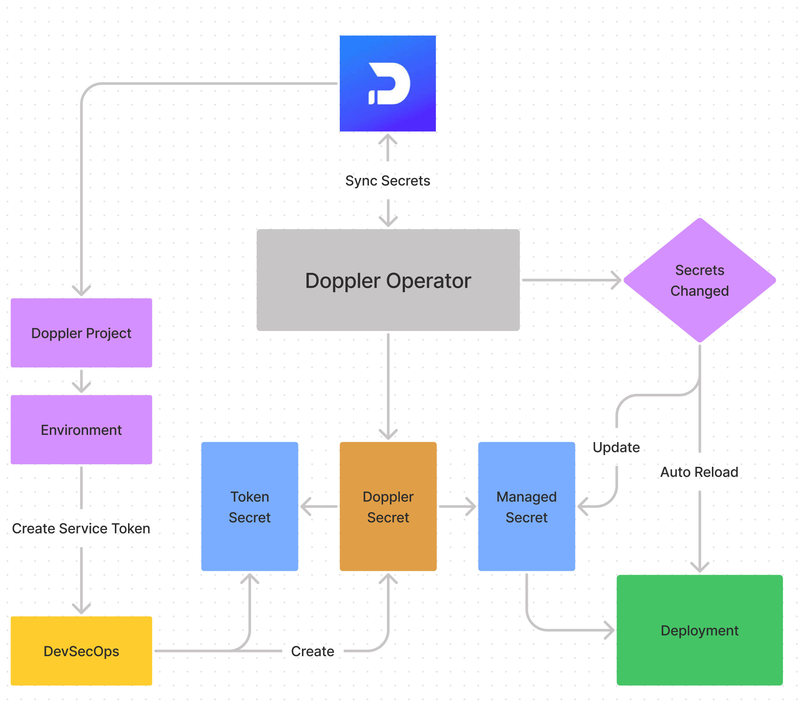

# Doppler Kubernetes Operator (Prerelease)

Automatically sync secrets from Doppler to Kubernetes and auto-reload deployments when secrets change.



## Overview

- The Doppler Kubernetes Operator is a controller which runs inside a deployment on your Kubernetes cluster
- It manages custom resources called `DopplerSecret`s, each of which contains a reference to a Kubernetes secret containing your Doppler Service Token and a reference to the Kubernetes secret where Doppler secrets should be synced
- The operator continuously monitors the Doppler API for changes to your Doppler config and updates the managed Kubernetes secret automatically
- If the secrets have changed, the operator can also reload deployments using the Kubernetes secret. See below for details on configuring auto-reload.

## Step 0: Enable Kubernetes Secret Encryption at Rest

The Doppler Kubernetes Operator uses [Kubernetes Secrets](https://kubernetes.io/docs/concepts/configuration/secret/) to store sensitive data. 

Kubernetes Secrets are, by default, stored as unencrypted base64-encoded strings. By default they can be retrieved - as plain text - by anyone with API access, or anyone with access to Kubernetes' underlying data store, etcd. Therefore, Kubernetes recommends enabling [encryption at rest](https://kubernetes.io/docs/tasks/administer-cluster/encrypt-data/) to secure this data.

## Step 1: Deploy the Operator

Deploy the operator by running:

```bash
make deploy
```

This will use your locally-configured `kubectl` to:

- Create a `doppler-operator-system` namespace
- Create the resource definition for a `DopplerSecret`
- Setup a service account and RBAC role for the operator
- Create a deployment for the operator inside of the cluster

You can verify that the operator is running successfully in your cluster with `./tools/operator-logs.sh`. This waits for the deployment to roll out and then tails the log. You can leave this command running to keep monitoring the logs or quit safely with Ctrl-C.

## Step 2: Create a `DopplerSecret`

A `DopplerSecret` is a custom Kubernetes resource with references to two secrets:

- A Kubernetes secret where your Doppler Service Token is stored (AKA "Doppler Token Secret"). This token will be used to fetch secrets from your Doppler config.
- A Kubernetes secret where your synced Doppler secrets will be stored (AKA "Managed Secret"). This secret will be created by the operator if it does not already exist.

> Note: While these resources can be created in any namespace, it is recommended that you create your Doppler Token Secret and DopplerSecret inside the `doppler-operator-system` namespace to prevent unauthorized access. The managed secret should be namespaced with the deployments which will use the secret.

Generate a Doppler Service Token and use it in this command to create your Doppler token secret:

```bash
kubectl create secret generic doppler-token-secret -n doppler-operator-system --from-literal=dopplerToken=dp.st.dev.XXXX
```

If you have the Doppler CLI installed, you can generate a Doppler Service Token from the CLI and create the Doppler token secret in one step:

```bash
kubectl create secret generic doppler-token-secret -n doppler-operator-system --from-literal=dopplerToken=$(doppler configs tokens create doppler-kubernetes-operator --plain)
```

Next, we'll create a `DopplerSecret` that references your Doppler token secret and defines the location of the managed secret.

```yaml
apiVersion: secrets.doppler.com/v1alpha1
kind: DopplerSecret
metadata:
  name: dopplersecret-test # DopplerSecret resource name
  namespace: doppler-operator-system # The Doppler operator namespace (recommended)
spec:
  # Omitted secret reference namespaces will default to match the namespace of the DopplerSecret
  tokenSecretRef: # Reference to Doppler Token Secret
    name: doppler-token-secret
    key: dopplerToken
  managedSecretRef: # Reference to Managed Secret (will be created automatically if does not exist)
    name: doppler-test-secret
    namespace: default
```

If you're following along with these example names, you can apply this sample directly:

```bash
kubectl apply -f config/samples/secrets_v1alpha1_dopplersecret.yaml
```

Check that the associated Kubernetes secret has been created:

```sh
# List all Kubernetes secrets created by the Doppler controller
kubectl describe secrets --selector=secrets.doppler.com/subtype=dopplerSecret
```

The controller continuously watches for secret updates from Doppler and when detected, automatically and instantly updates the associated secret.

Next, we'll cover how to configure a deployment to use the Kubernetes secret and enable auto-reloading for Deployments.

## Step 3: Configuring a Deployment

### Using the Secret in a Deployment

To use the secret created by the operator, we can use the managed secret in one of three ways. These methods are also covered in greater detail in the [Kubernetes Secrets documentation](https://kubernetes.io/docs/concepts/configuration/secret/).

#### `envFrom`

The `envFrom` field will populate a container's environment variables using the secret's Key-Value pairs:

```yaml
envFrom:
  - secretRef:
      name: doppler-test-secret # Kubernetes secret name
```

#### `valueFrom`

The `valueFrom` field will inject a specific environment variable from the Kubernetes secret:

```yaml
env:
  - name: MY_APP_SECRET # The name of the environment variable exposed in the container
    valueFrom:
      secretKeyRef:
        name: doppler-test-secret # Kubernetes secret name
        key: MY_APP_SECRET # The name of the key in the Kubernetes secret
```

#### `volume`

The `volume` field will create a volume that is populated with files containing the Kubernetes secret:

```yaml
volumes:
  - name: secret-volume
    secret:
      secretName: doppler-test-secret # Kubernetes secret name
```

Your deployment can use this volume by mounting it to the container's filesystem:

```yaml
volumeMounts:
  - name: secret-volume
    mountPath: /etc/secrets
    readOnly: true
```

### Automatic Redeployments

In order for the operator to reload a deployment, three things must be true:

- The deployment is in the same namespace as the managed secret
- The deployment has the `secrets.doppler.com/reload` annotation set to `'true'` (string)
- The deployment uses the managed secret

Here's an example of the reload annotation:

```yaml
annotations:
  secrets.doppler.com/reload: 'true'
```

The Doppler Kubernetes operator reloads deployments by updating an annotation with the name `secrets.doppler.com/secretsupdate.<KUBERNETES_SECRET_NAME>`. When this update is made, Kubernetes will automatically redeploy your pods according to the [deployment's configured strategy](https://kubernetes.io/docs/concepts/workloads/controllers/deployment/#strategy).

### Full Examples

Complete examples of these different deployment configurations can be found below:

- [`deployment-envfrom.yaml`](config/samples/deployment-envfrom.yaml)
- [`deployment-valuefrom.yaml`](config/samples/deployment-valuefrom.yaml)
- [`deployment-volume.yaml`](config/samples/deployment-volume.yaml)

If you've named your managed Kubernetes secret `doppler-test-secret` in the previous step, you can apply any of these examples directly:

```sh
kubectl apply -f config/samples/deployment-envfrom.yaml
kubectl rollout status -w deployment/doppler-test-deployment-envfrom
```

Once the Deployment has completed, you can view the logs of the test container:

```sh
kubectl logs -lapp=doppler-test
```

Setup is complete! To test the sync behavior, modify a secret in the Doppler dashboard and wait 60 seconds. Run the logs command again (or use the `watch` command) to see the pods automatically restart with the new secret data.

## Failure Strategy and Troubleshooting

### Inspecting Status

If the operator fails to fetch secrets from the Doppler API (e.g. a connection problem or invalid service token), no changes are made to the managed Kubernetes secret or your deployments. The operator will continue to attempt to reconnect to the Doppler API indefinitely.

The `DopplerSecret` uses `status.conditions` to report its current state and any errors that may have occurred.

In this example, our Doppler service token has been revoked and the operator is reporting an error condition:

```
$ kubectl describe dopplersecrets -n doppler-operator-system
Name:         dopplersecret-test
Namespace:    doppler-operator-system
Labels:       <none>
Annotations:  <none>
API Version:  secrets.doppler.com/v1alpha1
Kind:         DopplerSecret
Metadata:
  ...
Spec:
  ...
Status:
  Conditions:
    Last Transition Time:  2021-06-02T15:46:57Z
    Message:               Secret update failed: Doppler Error: Invalid Service token
    Reason:                Error
    Status:                False
    Type:                  secrets.doppler.com/SecretSyncReady
    Last Transition Time:  2021-06-02T15:46:57Z
    Message:               Deployment reload has been stopped due to secrets sync failure
    Reason:                Stopped
    Status:                False
    Type:                  secrets.doppler.com/DeploymentReloadReady
Events:                    <none>
```

You can safely modify your token Kubernetes secret or `DopplerSecret` at any time. To update our Doppler service token, we can modify our token Kubernetes secret directly and the changes will take effect immediately.

The `DopplerSecret` resource manages the managed Kubernetes secret but does not officially own it. Therefore, deleting a `DopplerSecret` will not automatically delete the managed secret.

### Included Tools

- [`tools/get-secret.sh`](tools/get-secret.sh) - fetch and decode a Kubernetes secret
- [`tools/operator-logs.sh`](tools/operator-logs) - wait for the operator deployment to roll out, then tail the logs

## Uninstalling

To uninstall the operator, first delete any `DopplerSecret` resources and any referenced Kubernetes secrets that are no longer needed.

Then, run the following command to delete all of the resources created during the initial `make deploy`:

```bash
make undeploy
```

## Development

This project uses the [Operator SDK](https://sdk.operatorframework.io).

When developing locally, you can run the operator using:

```bash
make install run
```

See the [Operator SDK Go Tutorial](https://sdk.operatorframework.io/docs/building-operators/golang/tutorial/#run-the-operator) for more information.

## Release

This project is released with Github Actions. Adding a Github Release will start an action which builds the operator image and publishes it to DockerHub. Tag names should match the pattern `vX.X.X`.
